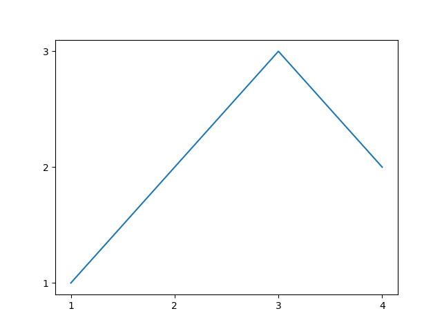

<h1> Exercícios de Python </h1> 

 
 Exercícios de lógica de programação, utilizando Python, na matéria de Lógica de Programação e Algoritimos do curso Ciência de Dados - Fatec 

 

<ul>
  <li>Lógica condicional</li>
  <li>Estruturas de repetição</li>
  <li>Vetores e Matrizes</li>
  <li>Funções</li>
  <li>Bibliotecas</li>
  <li>Gráficos</li>
</ul>
 

 
Primeiro gráfico gerado utilizando a biblioteca matplotlib